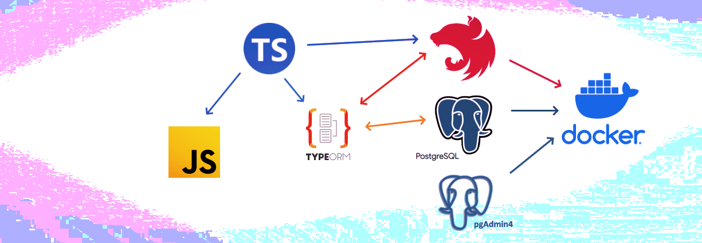

<p align="center">
  <a href="http://nestjs.com/" target="blank"></a>
</p>

[circleci-image]: https://img.shields.io/circleci/build/github/nestjs/nest/master?token=abc123def456
[circleci-url]: https://circleci.com/gh/nestjs/nest

  <p align="center">[NestJS](https://github.com/nestjs/nest) a progressive <a href="http://nodejs.org" target="_blank">Node.js</a> framework for building efficient and scalable server-side applications.</p>
    <p align="center">
<a href="https://www.npmjs.com/~nestjscore" target="_blank"></a>
<a href="https://www.npmjs.com/~nestjscore" target="_blank"></a>
<a href="https://circleci.com/gh/nestjs/nest" target="_blank"></a>

## Description

Nest (TypeScript) repository API Finance Manager.

```bash
# Works around bank transactions, monitoring expenses by categories, send webhooks, etc...
# Used: NestJs, TypeORM 0.3, PostgreSQL, pgAdmin, Docker, unit/e2e tests by Jest/Supertest
```

## Installation

```bash
$ npm install
```

## Running the app

```bash
# development
$ npm run start

# watch mode
$ npm run start:dev

# production mode
$ npm run start:prod
```

## Test

```bash
# unit tests
$ npm run test

# e2e tests
$ npm run test:e2e

# test coverage
$ npm run test:cov
```

## In Docker

Nest is an MIT-licensed open source project. It can grow thanks to the sponsors and support by the amazing backers. If you'd like to join them, please [read more here](https://docs.nestjs.com/support).

## API Documentation

### for local, pls run your app

- local. Swagger API. Doc - [localhost:3000/api/doc](http://localhost:3000/api/doc)
- local. Swagger JSON Doc - [localhost:3000/api/doc-json](http://localhost:3000/api/doc-jon)
- local. Swagger YAML Doc - [localhost:3000/api/doc-yaml](http://localhost:3000/api/doc-yaml)

### for external, just click

- External Swagger Doc - [static github page](https://mme83.github.io/nestjs-app-fm/index.html)
- External Doc - [static github page 2](https://mme83.github.io/nestjs-app-fm/docs/index.html)
